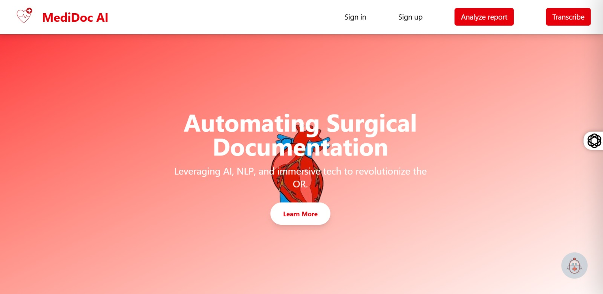
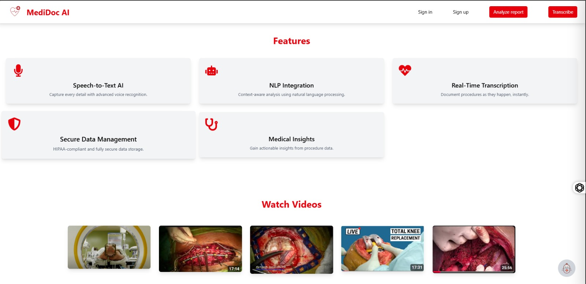
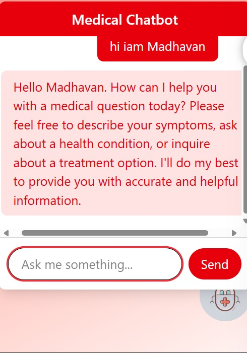
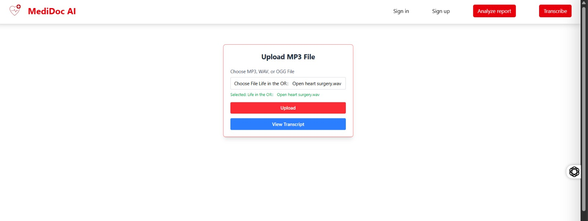
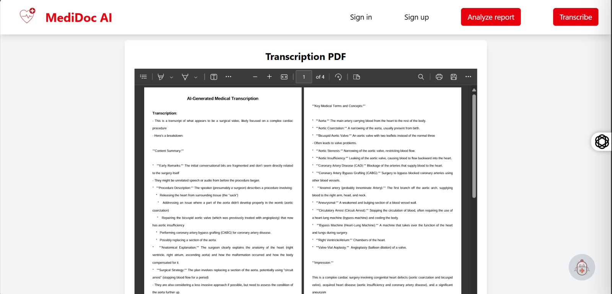
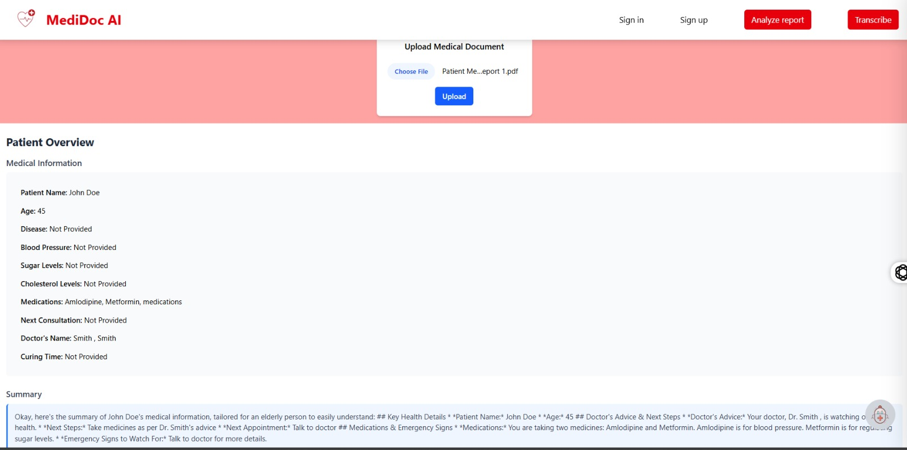
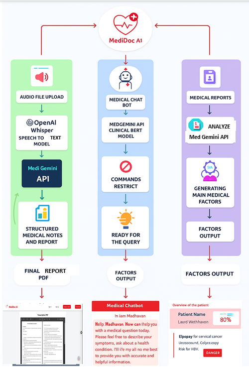

# MediDoc AI - Project Overview

## Introduction
MediDoc AI is an innovative platform designed to automate surgical documentation using AI, NLP, and immersive technologies. This README provides a step-by-step guide to understand and utilize the features of MediDoc AI, including embedded images from the interface.

## Steps to Use MediDoc AI

### 1. Accessing the Homepage
- **Description**: The homepage welcomes users with a clean interface featuring the MediDoc AI logo and options to sign in, sign up, analyze reports, or transcribe.
- **Action**: Visit the MediDoc AI website and view the main banner stating "Automating Surgical Documentation" with a "Learn More" button.
- **Image**: 
- **Purpose**: Introduces the platform's core mission and provides initial navigation options.

### 2. Exploring Features
- **Description**: The "Features" section highlights capabilities like Speech-to-Text, NLP Integration, Real-Time Transcription, Secure Data Management, and Medical Insights.
- **Action**: Scroll down to see cards detailing each feature with icons and brief descriptions (e.g., "Capture every detail with advanced voice recognition" for Speech-to-Text).
- **Image**: 
- **Purpose**: Offers a quick overview of the tools available for medical documentation and data management.

### 3. Watching Tutorial Videos
- **Description**: The "Watch Videos" section includes surgical procedure videos (e.g., "TOTAL KNEE REPLACEMENT") to assist users.
- **Action**: Click on any video thumbnail to view relevant surgical demonstrations.
- **Image**: 
- **Purpose**: Provides visual learning resources to enhance understanding of procedures.

### 4. Uploading a Medical Document
- **Description**: Users can upload a PDF medical document for analysis.
- **Action**: Click "Choose File", select a file (e.g., "Patient Me...eport 1.pdf"), and click "Upload".
- **Image**: 
- **Purpose**: Allows the system to process and analyze uploaded patient reports.

### 5. Uploading an MP3 File for Transcription
- **Description**: Users can upload audio files (MP3, WAV, or OGG) for real-time transcription.
- **Action**: Select "Choose MP3, WAV, or OGG File", pick a file (e.g., "open heart surgery.wav"), and click "Upload" followed by "View Transcript".
- **Image**: 
- **Purpose**: Converts audio recordings of medical procedures into text for documentation.

### 6. Viewing the Transcription PDF
- **Description**: After transcription, a PDF is generated with detailed medical transcription.
- **Action**: Review the "Transcription PDF" which includes sections like "AI-Generated Medical Transcription" and "Key Medical Terms and Concepts".
- **Image**: 
- **Purpose**: Provides a comprehensive record of the procedure with annotated medical terms.

### 7. Analyzing Medical Reports
- **Description**: The "Analyze report" feature processes uploaded documents to generate patient overviews.
- **Action**: After uploading (e.g., "Patient Me...eport 1.pdf"), view the "Patient Overview" with medical information like patient name, age, medications, etc.
- **Image**: 
- **Purpose**: Summarizes patient data and provides a tailored summary for easy understanding.

### 8. Interacting with the Medical Chatbot
- **Description**: The chatbot assists with medical queries.
- **Action**: Type a query (e.g., after saying "hi iam Madhavan") and receive responses like "Hello Madhavan. How can I help you with a medical question today?".
- **Image**: 
- **Purpose**: Offers real-time medical advice and support based on user input.

### 9. Understanding the Workflow (Diagram)
- **Description**: A flowchart outlines the process from audio upload to final PDF report via the MediDoc AI system.
- **Action**: Review the diagram showing steps like "Audio File Upload" → "Med Gemini API" → "Structured Medical Notes and Report" → "Final PDF Report".
- **Image**: 
- **Purpose**: Illustrates the end-to-end process of documentation automation.

## Conclusion
MediDoc AI streamlines surgical documentation with AI-driven tools, ensuring accuracy and efficiency. Follow the steps above to explore its features, upload documents, transcribe audio, and analyze reports effectively. The images are hosted in the repository root directory and should render on GitHub.
